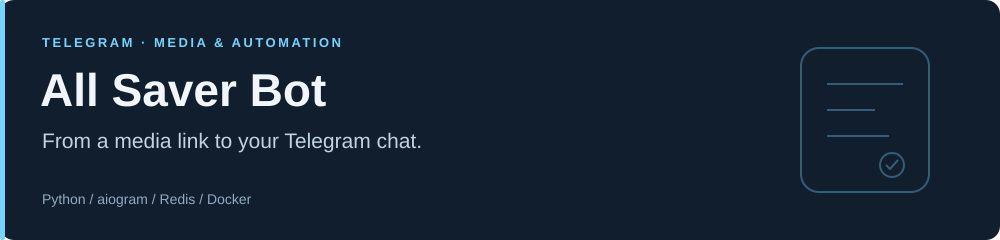

**A multilingual Telegram bot for downloading and managing media.**

[](https://github.com/akmalzokirjonov/all-saver-bot/actions/workflows/ci.yml)


[Features](#features) · [Quick start](#quick-start) · [Configuration](#configuration) · [Development](#development) · [O'zbekcha](#ozbekcha)

## Overview

Send a supported media URL to the bot, select a quality, and receive the result in Telegram. The interface supports **English, Uzbek, and Russian**.

This repository contains the Python application and Docker configuration. It does not include a hosted bot account or production credentials.

## Features

- Media extraction through yt-dlp, with quality selection and audio output.
- Retry handling, download progress, and FFmpeg compression for large files.
- Per-user and global download concurrency controls.
- User media uploads, file management, and configurable metadata expiry.
- Optional user-supplied cookies for authenticated downloads.
- Redis-backed conversation state and usage counters.
- Admin statistics through `/stats`.

Supported sites and available formats depend on yt-dlp and the source platform. External upload fallbacks may send media to third-party services; review `utils/uploader.py` before operating a public instance.

## Quick start

### Docker Compose

Install Docker with Compose, then:

```bash
git clone https://github.com/akmalzokirjonov/all-saver-bot.git
cd all-saver-bot
cp .env.example .env
```

On Windows PowerShell, use `Copy-Item .env.example .env`.

Edit `.env`:

```dotenv
BOT_TOKEN=replace_with_your_botfather_token
BOT_USERNAME=your_bot_username
ADMIN_IDS=123456789,987654321
```

`ADMIN_IDS` is optional. Use numeric IDs separated by commas, a JSON array, or leave it empty to disable admin access.

```bash
docker compose up -d --build
docker compose logs -f bot
# Stop containers; named data volumes are retained:
docker compose down
```

The polling process requires a continuously running host. Redis has a dependency health check; the bot container's running state does not prove that Telegram or a source website is reachable.

### Local development

Requires **Python 3.12+**, **Redis**, **FFmpeg**, and a JavaScript runtime supported by yt-dlp for sites that need one.

```bash
python -m venv .venv
source .venv/bin/activate
# Windows PowerShell: .\.venv\Scripts\Activate.ps1
pip install -r requirements.txt
```

Start Redis locally and set these values in `.env`:

```dotenv
REDIS_URL=redis://localhost:6379/0
DOWNLOAD_DIR=./tg_downloads
```

Then run `python main.py`. Do not run a second polling instance with the same bot token.

## Configuration

| Variable | Default | Purpose |
| :--- | :--- | :--- |
| `BOT_TOKEN` | Required | Telegram token from BotFather |
| `ADMIN_IDS` | Empty | IDs allowed to use admin commands |
| `BOT_USERNAME` | `TelebramBot` | Bot name used in startup logging |
| `REDIS_URL` | `redis://localhost:6379/0` | Redis connection; Compose overrides the host to `redis` |
| `DOWNLOAD_DIR` | `/tmp/tg_downloads` | Working directory for media |
| `MAX_FILE_SIZE_MB` | `50` | Configured media size threshold |
| `MAX_CONCURRENT_PER_USER` | `2` | Per-user download slots |
| `MAX_GLOBAL_CONCURRENT` | `20` | Global slots; the example environment uses `10` |
| `ACTIVE_DOWNLOAD_TTL_SECONDS` | `3600` | Expiry for active-download counters |
| `MAX_PLAYLIST_VIDEOS` | `5` | Playlist limit |
| `COOKIE_EXPIRE_DAYS` | `30` | Stored-cookie expiry |
| `FILE_EXPIRE_HOURS` | `24` | Uploaded-file metadata expiry |
| `DEFAULT_LANG` | `en` | Default interface language |
| `LOG_LEVEL` | `INFO` | Logging level |
| `LOG_FILE` | `logs/bot.log` | Log destination |

For the complete template, see [`.env.example`](.env.example).

## Commands

| Command | Action |
| :--- | :--- |
| `/start`, `/help` | Introduction and usage |
| `/language` | Change the interface language |
| `/cookies`, `/deletecookies` | Add or remove authentication cookies |
| `/myfiles` | List and manage uploaded media |
| `/stats` | Usage statistics for configured admins |

## Architecture

```text
main.py                 Polling, lifecycle, Redis state, middleware
config.py               Validated environment configuration
download_queue.py       Per-user and global download slots
handlers/               Telegram commands, uploads, downloads, callbacks
utils/                  yt-dlp, compression, uploads, Redis, translations
middlewares/            Request throttling
keyboards/              Inline controls
tests/                  Offline configuration and routing regression tests
```

`api/webhook.py` and `vercel.json` are legacy experimental files. The webhook path has not been validated for production: it does not initialize the polling app's Redis storage and middleware and lacks webhook secret verification. Use the documented polling deployment.

## Development

```bash
python -m pip check
python -m unittest discover -s tests -v
```

GitHub Actions runs these checks on pushes and pull requests. Tests cover environment parsing and command routing without contacting Telegram, Redis, or media websites. Live downloads and deployment availability require a separately configured instance.

## Handling credentials and media

Keep `.env`, cookies, logs, and runtime media out of version control and image layers. Both `.gitignore` and `.dockerignore` exclude them. Supply secrets at runtime.

Cookies can grant account access. Use only trusted bot deployments, remove cookies with `/deletecookies` when finished, and download only media you are authorized to access.

## O'zbekcha

**All Saver Bot** — media havolalarini Telegram orqali yuklash va fayllarni boshqarish boti.

1. Loyihani yuklab oling va `.env.example` nusxasini `.env` deb saqlang.
2. BotFather bergan tokenni `BOT_TOKEN` ga yozing.
3. Adminlar kerak bo'lsa, raqamli ID'larni `ADMIN_IDS=123456789,987654321` shaklida kiriting.
4. `docker compose up -d --build` bilan ishga tushiring.
5. Holatni `docker compose logs -f bot` orqali kuzating.

Tilni almashtirish: `/language` · Fayllar: `/myfiles` · Admin statistikasi: `/stats`.
